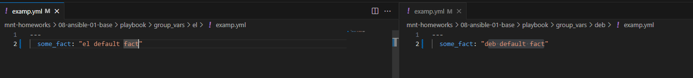
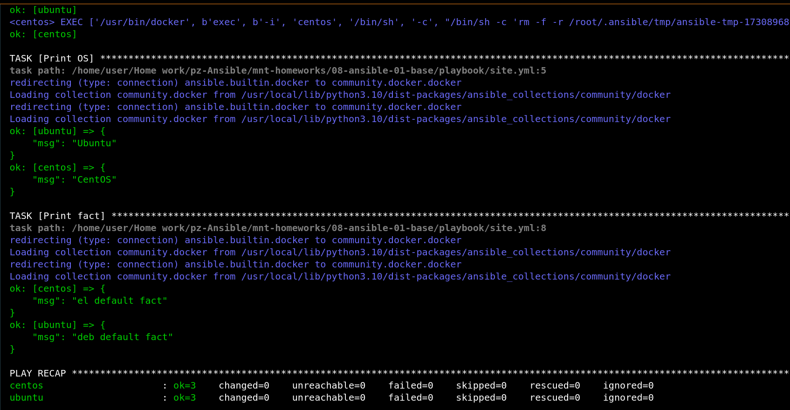
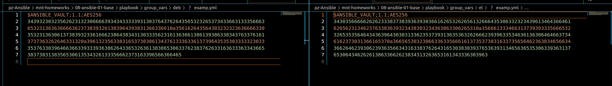
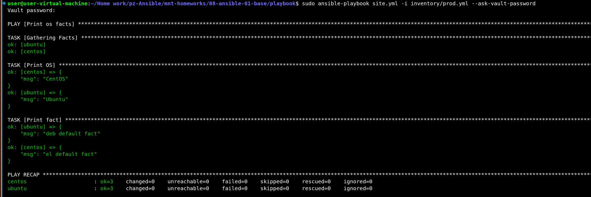
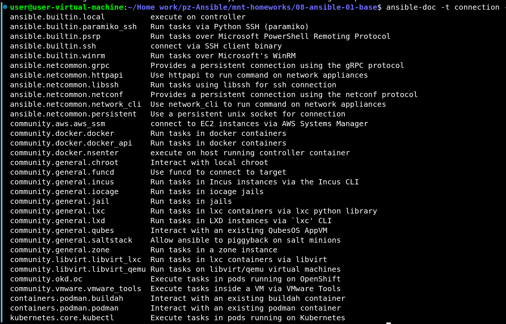
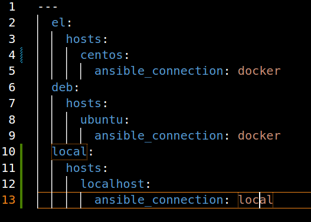
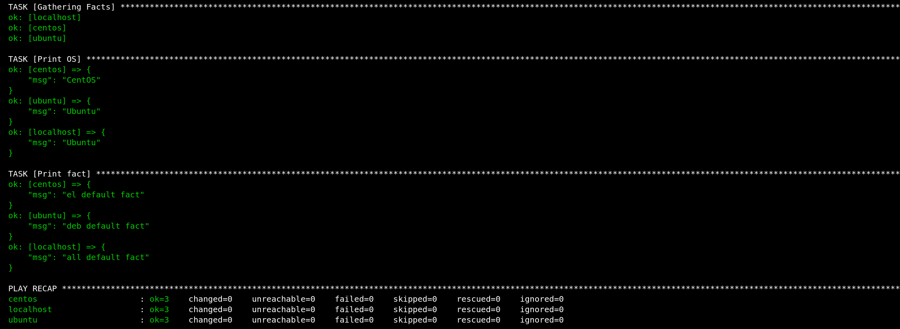

# Домашнее задание к занятию 1 «Введение в Ansible»

Основная часть:

1. Запуск playbook из окружения на окружении из `test.yml`

Команда: `ansible-playbook site.yml -i inventory/test.yml`

Значение факта для хоста: 12

2. Поменял в examp.yml Значение переменной `some_fact` с 12 на all default fact 

3. Подготовленное окружение:

4. Запуск playbook из окружения на окружении из `prod.yml`

5. Изменение значение переменной:

6. Повтор запуска playbook:

7. Шифрование переменных с помощью `ansible-vault`

8. Повтор запуска playbook:

9. `ansible-doc -t connection -l`
Подойдет Local

10. Обновленный prod.yml

11. Повтор запуска playbook:

