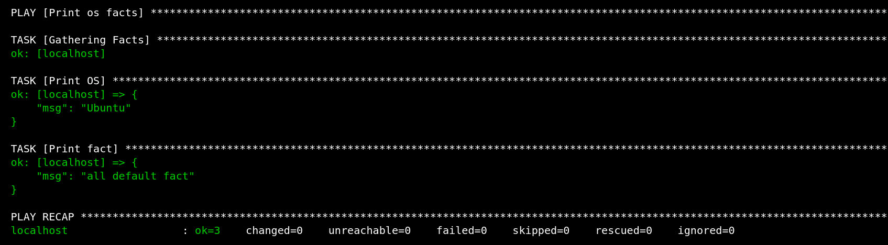

# Домашнее задание к занятию 1 «Введение в Ansible»

Основная часть:

1. Запуск playbook из окружения на окружении из `test.yml`

Команда: `ansible-playbook site.yml -i inventory/test.yml`

Значение факта для хоста: 12

2. Поменял в examp.yml Значение переменной `some_fact` с 12 на all default fact 

3. Подготовленное окружение:

4. Изменение значение переменной:

5. Повтор запуска playbook из окружения на окружении из `prod.yml`:

6. Шифрование переменных с помощью `ansible-vault`

7. Повтор запуска playbook:

8. `ansible-doc -t connection -l`
Подойдет Local

9. Обновленный prod.yml

10. Повтор запуска playbook:

